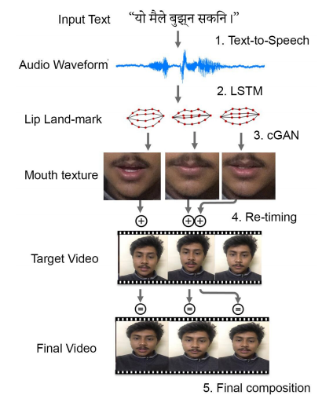
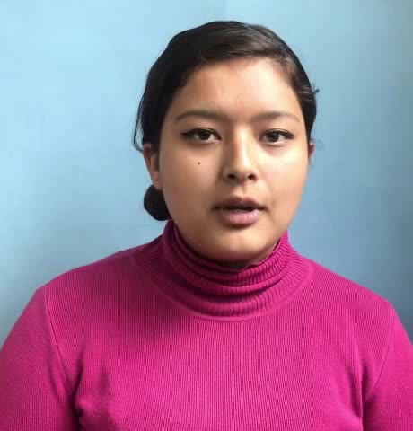
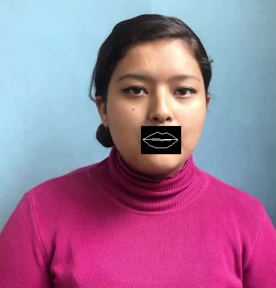
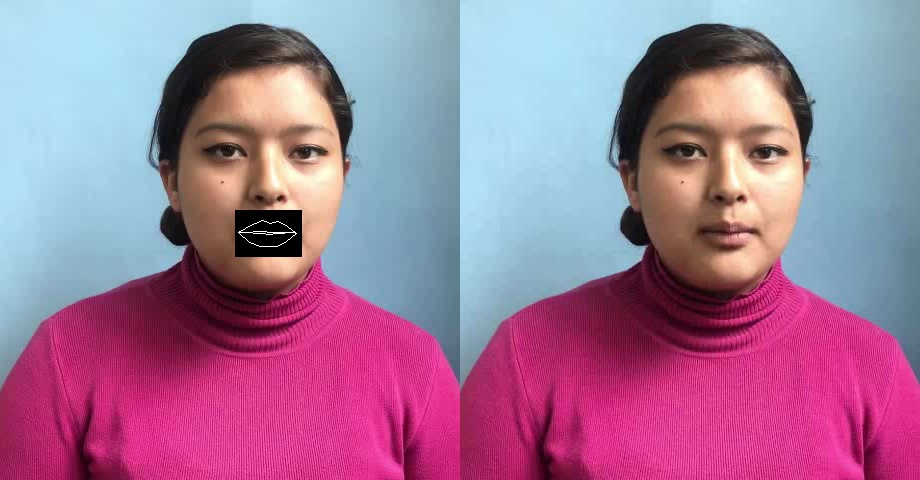

# First Nepali AI Anchor 


Given Nepali Unicode text of a news article, we synthesize a high quality video of an anchor presenting the content provided in the input text with professional news broadcasting backdrop. Trained on many hours of a person narrating news articles, a recurrent neural network learns the mapping from audio generated from the input text to mouth shapes which then is used to synthesize high quality mouth texture, and composite it to what he might have looked pronouncing the input texts.


>This project was submitted to Itonics Hackathon 2019. 

# The project depends on the following Python packages:
- Keras --- 2.2.5
- Tensorflow --- 1.15.0
- Librosa --- 0.6.0
- opencv-python --- 3.4.2.16
- dlib --- 19.7.0
- tqdm
- subprocess
- matplotlib
- gTTS

It also depends on the following packages:
- ffmpeg --- 3.4.1 (dataset generation from video clip + final frames to video conversion )

The code has been tested on Windows 10 and Google colab.

### Project WorkFlow


# Feature Extraction For LSTM
You can run lstm_featureExtractor file to extract features from videos directly. The arguments are as follows:

The dataset used to train lstm is GridCorpus.
In the cmd below $i is the speaker number
```sh

$ "http://spandh.dcs.shef.ac.uk/gridcorpus/s$i/video/s$i.mpg_vcd.zip" > "s$i.zip"
$ unzip -q "video/s$i.zip" -d "../video"
```
- -vp --- Input folder containing video files (if your video file types are different from .mpg - or .mp4, please modify the script accordingly)
- -sp --- Path to shape_predictor_68_face_landmarks.dat. You can download this file [here](https://github.com/AKSHAYUBHAT/TensorFace/blob/master/openface/models/dlib/shape_predictor_68_face_landmarks.dat).
- -o --- Output file name

Usage:
```sh
$ python featureExtractor.py -vp path-to-video-files/ -sp path-to-shape-predictor-68-face-landmarks-dat -o output-file-folders
```

# Train LSTM
The training code has the following arguments:

- -i --- Input file containing folder with training data
- -u --- Number of hidden units
- -d --- Delay in terms of frames, where one frame is 40 ms
- -c --- Number of context frames
- -o --- Output folder path to save the model
- 
Usage:
```sh
$ python lstm_train.py -i path-to-train-file/ -u number-of-hidden-units -d number-of-delay-frames -c number-of-context-frames -o output-folder-to-save-model-file
```

# LSTM Generate
The generation code has the following arguments:

- -i --- Input speech file
- -m --- Input talking face landmarks model
- -d --- Delay in terms of frames, where one frame is 40 ms
- -c --- Number of context frames
- -o --- Output path


Usage:
```sh
$ python lstm_generate.py -i /audio-file-path/ -m /model-path/ -d 1 -c 3 -o /output-folder-path/ 
```

## PIX2PIX
As we know Pix2Pix is the conditional GAN (Generative Adversarial Networks) .  For this project we used pix2pix based on U-Net Architecture.
> Special Thanks to our Friend Swastika K.C. for the preparation of the dataset.
### Hyper-Parameters
-   Image Size = 256x256 (Resized)
-   Batch Size = 1 or 4
-   Learning Rate = 0.0002
-   Adam_beta1 = 0.5
-   Lambda_A = 100 (Weight of L1-Loss)

## Train Pix2Pix Network .
1. Preparing Dataset 
- Extract frames from video (check ffmpeg_video_to_frames.txt )


- Generate facial landmark blacked images from above frames.
```
$ python black.py
This uses dlib for facial landmark and opencv for drawing it on images.
```

- Combine respective frames into one images 
```
$ python combineimage.py
```


2. Make npz file out of the dataset
``` 
$ > python npz.py
```
3. Train Pix2Pix 
```
$ > python pix2pix_Keras.py
```
> Generator Model is saved on Every Epoch and " Sample Dataset - Original - Generated " Image is saved after couple of thousand batches.

### Few generated Samples Images :


## Now after Everything is Trained and models are generated Time to Test the Network.
> Lets generate anchor video out of the inputted Nepali Texts.


1. Generate mp3 file out of Inputted Text .
> We used gTTS python module which basically uses Google Text-To-Speech API for generating speech.
```
$ python tts.py

(Edit the python file for your custom text.)
This should generate good.mp3 file of your text.
```
2. Fed the mp3 file to LSTM model and get the landmark file.
> Refer LSTM Generate section above 
```
This generates the data.npz file out inputted speech file(.mp3)
```

3. Next generate frames out of data.npz and generate the  final anchor video ( along with audio yeah )
```
$ python ok.py

> Too lazy to rename the file properly at 3 AM day before the event;)
> This single will literally do everything from  
"" landmark npz file parsing - landmark alignment - frame generation - pix2pix predict - final array to image - collect frames - ffmpeg video generation - adding audio layer to video - saving final output ""
```
4. Finally you get  OUTPUT.mp4 


## Current Output Details :
- Dimension: 256*256
- Codec : H.264 (High Profile)
- Frame Rates : 26 fps
- Bit-Rate : 3660 kbps
- Audio Codec : MPEG-1 Layer 3
- Channels: Mono
- Sample Rate : 24000 Hz
- Audio Bit Rate : 32kbps


## Further Works .
- Generate High Resolution Video .
> Target : HD video (at least 720p) 
> Current Size : 256*256 pixels

- Create Own TTS 
-  Code with Arguments (pix2pix + prediction part)
-  many more ......

> Haven't slept properly for 5 days time But hey our hardwork pay off We Won the Competition , yay Cheers !!

